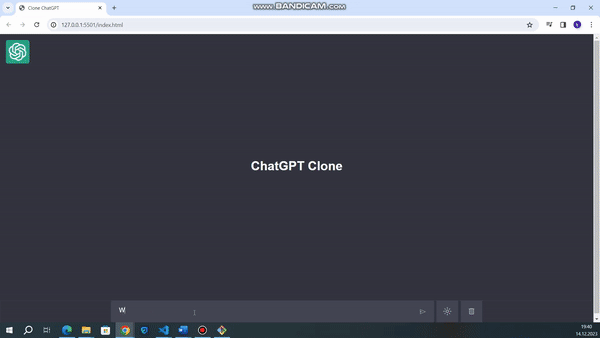

<h1>CHATGPT CLONE</h1>

This is a clone project of ChatGpt. The API is ChatGTP’s own api. When you enter a prompt, you will get an answer from the ChatGpt artificial intelligence. There are dark and light mode options, you can delete the prompts you have entered at any time and it has a full responsive design.

If you would like to experience it as well, you just need to enter the API you obtained from ChatGpt in the API section of main.js and enjoy.

<h2> Software Languages </h2>

- HTML

- CSS

- JavaScript

<h2> Screen Gif </h2>

